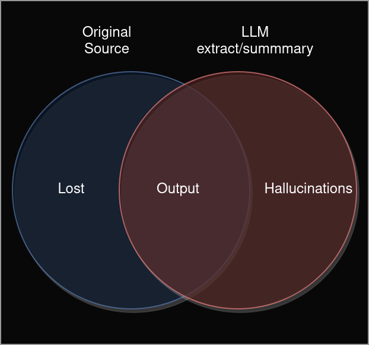

## Why this matters

Evaluating the performance of a LLM model for cyber security comes with many challenges.
One of the more natural metric would be to to rank the completeness and truthfullnes of a retreival.



Looking a this diagram, we see three potential cases:

 - Lost: Information that was in the original source
 - Output: The output of our model
 - Hallucinations: New information that our model made up

## Why NER?

We can't do this with every word, but rather we need to find a way to seperate hard facts from fluff.
NER - Named entity recognition is a way to identify hard facts like people and places in a text.
In our case the entites will be things like IPs, exploits and threat actors, some of which are easy to extract (like IP-Addresses), other will require to resort to AI to identify.

NER in this case is more than just a metric. It's also an assurance policy for any LLM deployed in the wild.
With NER we can make sure that our LLM stays true to the source material and our summaries are complete.

Besides that there will be many other usecases for NER in cyber security applications.


## Metrics

Here's a simple Python function to demonstrate this idea. 
We'll assume that entity recognition is performed by some hypothetical function `entity_recognition(text)` that returns a list of entities for a given text. 
For demonstration, we'll simulate the output of such a function. 

The function will calculate the following:

 -   True Positives (TP): Entities correctly identified in both the original and the summary.
 -   False Positives (FP): Entities identified in the summary that are not in the original.
 -   False Negatives (FN): Entities in the original that were missed in the summary.
 -   Precision: TP / (TP + FP)
 -   Recall: TP / (TP + FN)
 -   F1 Score: 2 * (Precision * Recall) / (Precision + Recall)


```python

	def evaluate_summary(original_entities, summary_entities):
	    """
	    Evaluate the summary based on entity recognition results.
	    
	    :param original_entities: List of entities in the original document
	    :param summary_entities: List of entities in the summary document
	    :return: A dictionary with precision, recall, F1 score, and counts of TP, FP, FN
	    """
	    # Convert lists to sets for easier calculation
	    original_entities_set = set(original_entities)
	    summary_entities_set = set(summary_entities)
	    
	    # Calculate True Positives (TP), False Positives (FP), and False Negatives (FN)
	    TP = len(original_entities_set.intersection(summary_entities_set))
	    FP = len(summary_entities_set - original_entities_set)
	    FN = len(original_entities_set - summary_entities_set)
	    
	    # Calculate Precision, Recall, and F1 Score
	    precision = TP / (TP + FP) if (TP + FP) > 0 else 0
	    recall = TP / (TP + FN) if (TP + FN) > 0 else 0
	    f1_score = 2 * (precision * recall) / (precision + recall) if (precision + recall) > 0 else 0
	    
	    return {
		"TP": TP,
		"FP": FP,
		"FN": FN,
		"Precision": precision,
		"Recall": recall,
		"F1 Score": f1_score
	    }

	# Simulate entity recognition output for demonstration
	original_entities = ["Alice", "Bob", "Quantum Physics", "University of Wonderland"]
	summary_entities = ["Alice", "Quantum Physics", "University of Wonderland", "Magic"]

	# Evaluate the summary
	evaluation_result = evaluate_summary(original_entities, summary_entities)
	evaluation_result

```

> Result
>
> {'TP': 3,
>  'FP': 1,
>  'FN': 1,
>  'Precision': 0.75,
>  'Recall': 0.75,
>  'F1 Score': 0.75}


## Named Entities in CTI

The entites here are heavily inspired by STIX, though this is still an early sketch:

| Tag Name        | Method | Pattern/Label            | Examples                           |
|-----------------|--------|--------------------------|------------------------------------|
| `IPV4_ADDRESS`  | regex  | `\b\d{1,3}\.\d{1,3}\.\d{1,3}\.\d{1,3}\b` | `192.168.1.1`, `10.0.0.1`, `172.16.254.1` |
| `IPV6_ADDRESS`  | regex  | `(complex pattern for IPv6)` | `2001:0db8:85a3:0000:0000:8a2e:0370:7334`, `::1`, `fe80::202:b3ff:fe1e:8329` |
| `DOMAIN`        | regex  | `([a-z0-9]+(-[a-z0-9]+)*\.)+[a-z]{2,}` | `example.com`, `subdomain.example.org`, `openai.com` |
| `URL`           | regex  | `(https?://)?([\da-z\.-]+)\.([a-z\.]{2,6})([\/\w \.-]*)*\/?` | `http://example.com`, `https://sub.example.org/path`, `openai.com` |
| `EMAIL_ADDRESS` | regex  | `[a-zA-Z0-9._%+-]+@[a-zA-Z0-9.-]+\.[a-zA-Z]{2,}` | `john@example.com`, `alice@openai.com`, `admin@test.org` |
| `MD5_HASH`      | regex  | `\b[a-f0-9]{32}\b` | `e99a18c428cb38d5f260853678922e03`, `d41d8cd98f00b204e9800998ecf8427e`, `098f6bcd4621d373cade4e832627b4f6` |
| `SHA1_HASH`     | regex  | `\b[a-f0-9]{40}\b` | `5baa61e4c9b93f3f0682250b6cf8331b7ee68fd8`, `2fd4e1c67a2d28fced849ee1bb76e7391b93eb12`, `a94a8fe5ccb19ba61c4c0873d391e987982fbbd3` |
| `SHA256_HASH`   | regex  | `\b[a-f0-9]{64}\b` | (Examples for this hash type would be long, so it's common to see just partials like `0e4d7...aad3f`) |
| `FILE_PATH`     | regex  | `(pattern depends on OS specifics)` | `C:\Windows\system32`, `/home/user/file.txt`, `\\Network\Share\file.doc` |
| `CVE_ID`        | regex  | `CVE-\d{4}-\d{4,}` | `CVE-2021-3156`, `CVE-2020-1472`, `CVE-2019-0708` |
| `PORT_NUMBER`   | regex  | `\b\d{1,5}\b` | `80`, `443`, `22` |
| `REGISTRY_KEY`  | regex  | `(HKEY_[a-zA-Z0-9_]+\\)([a-zA-Z0-9_\\]*)*` | `HKEY_LOCAL_MACHINE\SOFTWARE\Microsoft\Windows`, `HKEY_CURRENT_USER\Software\OpenAI`, `HKEY_CLASSES_ROOT\.txt` |
| `MALWARE`       | ner    | `MW` | `LockBit`, `DarkSide`, `WannaCry` |
| `THREAT_ACTOR`  | ner    | `TA` | `BlueCharlie`, `APT28`, `Lazarus Group` |
| `SOFTWARE`      | ner    | `SW` | `LockBit 2.0`, `Windows 10`, `OpenSSH` |
| `TTP`           | ner    | `TTP` | `spear-phishing`, `drive-by download`, `credential stuffing` |
| `OS`            | ner    | `OS` | `Windows`, `Linux`, `macOS` |
| `HARDWARE`      | ner    | `HW` | `iPhone`, `Netgate Firewall`, `Raspberry Pi` |
| `USERNAME`      | ner    | `USR` | `john_doe`, `admin`, `guest` |
| `ORGANIZATION`  | ner    | `ORG` | `Insikt Group`, `OpenAI`, `Microsoft` |
| `SECTOR`        | ner    | `SCT` | `finance`, `healthcare`, `energy` |
| `GEO_LOCATION`  | ner    | `LOC` | `Russia`, `New York`, `Silicon Valley` |
| `EXPLOIT_NAME`  | ner    | `EXP` | `EternalBlue`, `Heartbleed`, `Shellshock` |
| `DATE`          | ner    | `DAT` | `March 2023`, `September 2022`, `Q2 2021` |
| `TIME`          | ner    | `TIM` | `10:00 AM`, `23:45`, `midnight` |


## Prior-Art

- https://arxiv.org/abs/2204.05754
- https://cybersecurity.springeropen.com/articles/10.1186/s42400-021-00072-y
- https://www.sciencedirect.com/science/article/pii/S1877050923000273
- https://github.com/aiforsec/CyNER
- https://aclanthology.org/R19-1128.pdf
- https://ieeexplore.ieee.org/document/9527981
- https://huggingface.co/CyberPeace-Institute/SecureBERT-NER (Vielversprechend)
- https://huggingface.co/sudipadhikari/cybersecurity_ner-v2 ???

## Tutorials

- https://www.youtube.com/watch?v=Q1i4bIIFOFc


## Software:

### NER Frameworks
- https://eyurtsev.github.io/kor/tutorial.html
- https://github.com/explosion/spacy-llm
- https://spacy.io/usage/large-language-models

### Tracing

- https://www.langchain.com/langsmith